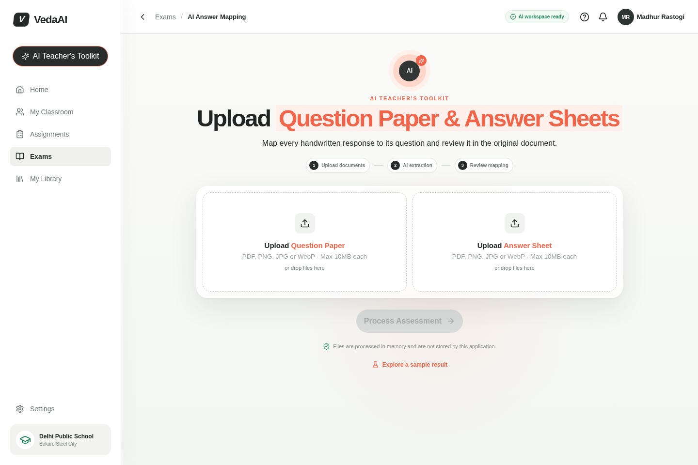
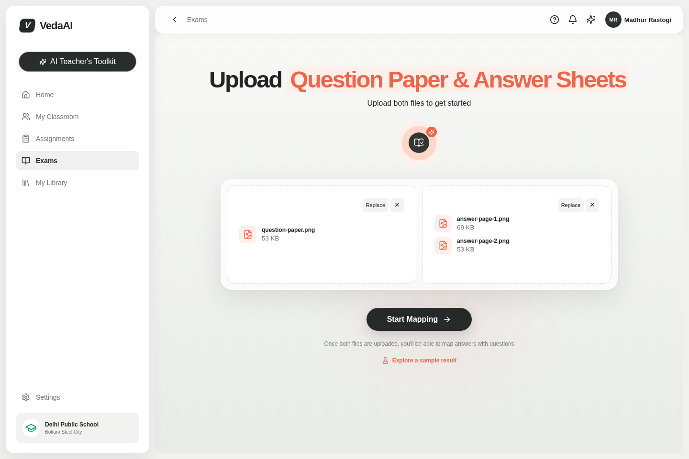
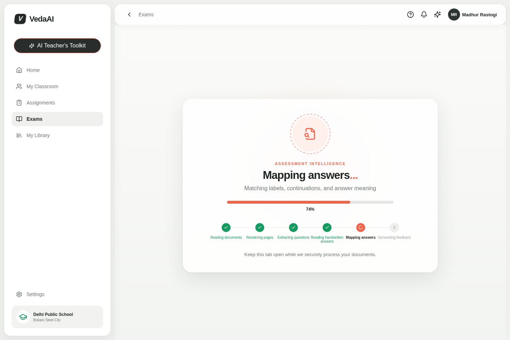
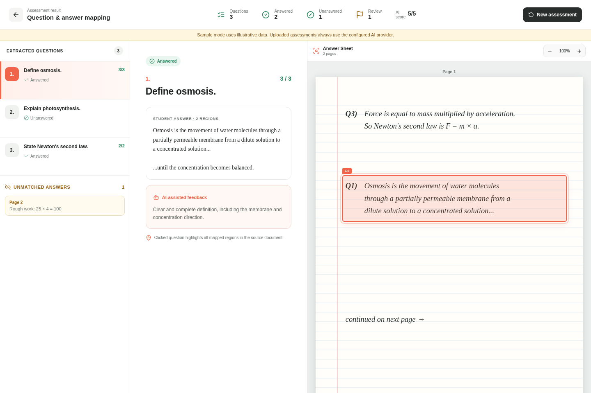
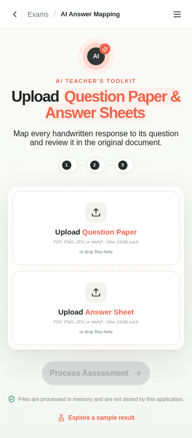
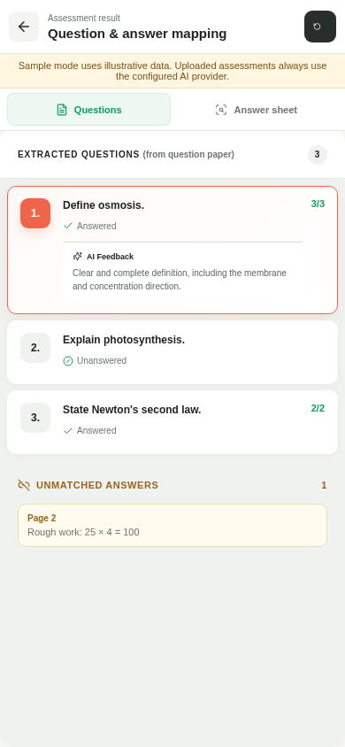
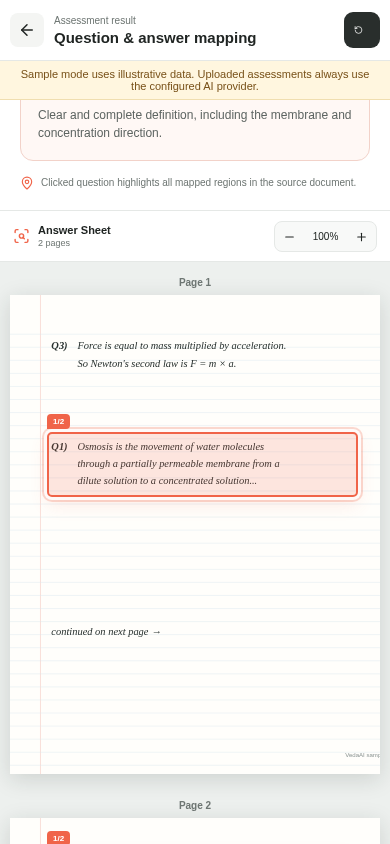
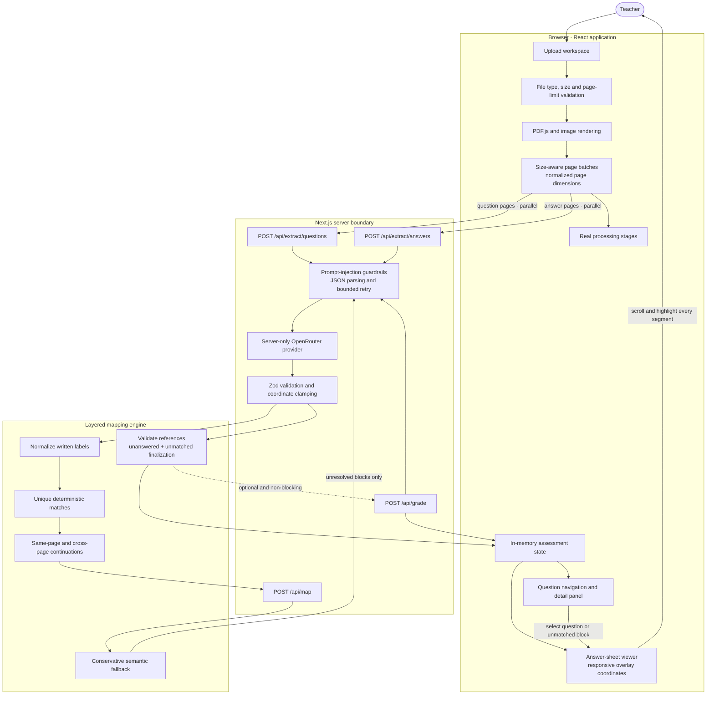
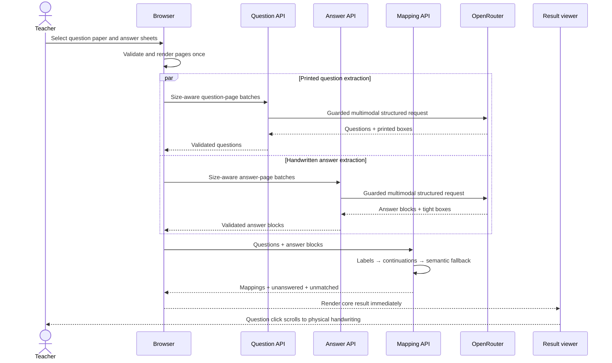

# VedaAI Assessment Mapper

A teacher-focused web application that extracts questions from a printed assessment, reads handwritten answer regions, maps each region to the correct question, and highlights the exact source handwriting when a question is selected.

The application follows the supplied VedaAI desktop/mobile design direction while prioritizing answer-region accuracy, conservative matching, and reviewable uncertainty.

## Product output

### Upload workspace



### Documents ready



### Multi-stage processing



### Question-to-answer mapping



### Responsive experience

| Mobile upload | Mobile review | Mobile source viewer |
|---|---|---|
|  |  |  |

The screenshots above are captured from the running application with Playwright. The result views use the built-in, explicitly labelled synthetic reviewer fixture; production uploads use the configured OpenRouter model.

### Verified output

| Check | Result |
|---|---|
| Question labels and printed order | Preserved, including independent sub-parts |
| Out-of-order answer mapping | Supported |
| Multi-page answers | Stored and highlighted as multiple segments |
| Unanswered questions | Explicitly retained |
| Unmatched handwriting | Retained and source-navigable |
| Responsive bounding boxes | Percentage-positioned over the rendered page |
| Automated tests | 25 passing |
| TypeScript / ESLint | Passing |
| Next.js production build | Passing |
| Production dependency audit | 0 vulnerabilities |

## Capabilities

- Question-paper and answer-sheet upload by file picker or drag-and-drop
- PDF, PNG, JPEG, and WebP support, including multiple image files
- Browser-side PDF rendering at OCR-friendly resolution
- Printed-order question extraction with original labels and separate sub-parts
- Handwritten answer-block transcription with normalized page-relative bounding boxes
- Layered mapping: deterministic labels, multi-page continuations, then semantic AI fallback
- Explicit answered, unanswered, low-confidence, and unmatched states
- Exact, responsive answer overlays with automatic scrolling and zoom
- Optional AI-assisted grading that cannot block the core extraction result
- Progressive processing, partial-failure handling, accessible controls, and responsive layout
- A clearly labelled sample result for reviewers without credentials
- Developer overlay mode at `/?debug=1`

## Stack

- Next.js App Router, React, and strict TypeScript
- Zod for all model and API boundaries
- PDF.js for local PDF-to-image rendering
- OpenRouter Chat Completions API through a server-only provider abstraction
- Vitest for normalization, ordering, mapping, continuation, validation, and bounding-box tests
- Purpose-built CSS matching the restrained VedaAI product direction

## Architecture



### Processing sequence



Important locations:

- `components/assessment-app.tsx` — browser processing orchestration and partial-failure behavior
- `components/results/answer-viewer.tsx` — page rendering, scroll targeting, zoom, and normalized overlays
- `lib/ai/` — OpenRouter client, injection-resistant prompts, extraction, semantic mapping, and grading
- `lib/mapping.ts` — deterministic assignment, continuation logic, validation, unanswered/unmatched finalization
- `lib/client/documents.ts` — file validation and one-time PDF/image preprocessing
- `lib/schemas.ts` and `lib/types.ts` — trusted contracts for otherwise untrusted model output
- `tests/` — core correctness suite

## Setup

Requirements: Node.js 20.9+ (an active LTS release is recommended) and npm.

```bash
npm install
cp .env.example .env.local
npm run dev
```

Open [http://localhost:3000](http://localhost:3000).

Configure `.env.local`:

```env
OPENROUTER_API_KEY=your_key_here
OPENROUTER_MODEL=dots-studio/dots-3-note-preview:free
OPENROUTER_APP_URL=http://localhost:3000
OPENROUTER_APP_NAME=VedaAI Assessment Mapper
AI_BENCHMARK_LOGS=false
```

`OPENROUTER_MODEL` must resolve to a vision-capable model. The default above won the included free-model benchmark. `openrouter/free` is convenient for exploration, but its random routing makes evaluation less reproducible. Never use a `NEXT_PUBLIC_` prefix for the API key.

## Processing design

### Extraction

Question and answer pages are rendered once in the browser, constrained to a maximum dimension of 1800 pixels, and sent concurrently to separate server routes. Size-aware batches keep each request under the deployment payload ceiling while retaining adjacent pages together whenever possible. Prompts explicitly preserve printed identifiers, split labelled sub-parts, reject document-borne prompt injection, require uncertainty rather than invention, and describe the normalized coordinate convention. Every response is parsed as JSON and validated with Zod; malformed structured output receives one limited retry.

### Mapping

Mapping is deliberately not a single opaque AI call:

1. Normalize explicit labels such as `Q11(a)`, `11-a`, and `11 (a)` to the same internal identifier.
2. Match only unique deterministic identifiers at high confidence.
3. Attach credible same-page or next-page continuations as additional physical segments.
4. Send only unresolved blocks and compact question text to semantic mapping, where `unmatched` is an explicit valid answer.
5. Reject unknown IDs, low-confidence forced mappings, and disappearing blocks; generate an unanswered record for every question and an unmatched record for every unclaimed block.

If semantic mapping is unavailable, deterministic matches are still rendered and unresolved blocks remain visible.

### Highlighting

Each answer segment stores `{x, y, width, height}` in a page-relative `0..1` coordinate system. The viewer page is a positioned element whose aspect ratio matches the rendered source. Overlay coordinates are converted to percentages, so highlights remain aligned at every responsive width and zoom level. Selecting a question activates all its segments and smoothly scrolls to the first, including when segments span pages.

## Commands

```bash
npm run dev        # development server
npm test           # unit/integration-style pipeline tests
npm run lint       # lint checks
npm run typecheck  # strict TypeScript checks
npm run build      # optimized production build
npm start          # serve the production build
npm run screenshots # recapture every README product state
```

## Reviewer and debug modes

Click **Explore a sample result** on the upload screen to inspect mapping, multi-page highlighting, unanswered, unmatched, scoring, and responsive behavior without invoking AI. This sample is explicitly identified in the interface; normal uploads always use the server-side OpenRouter path.

Append `?debug=1` to show every extracted answer-block box, internal IDs, normalized labels, mapping method, confidence, and segment JSON.

For benchmark runs, set `AI_BENCHMARK_LOGS=true`. Server logs will include task name, pinned model, duration, attempt, and token usage, but never question text or student-answer content. Pin `OPENROUTER_MODEL` and run the same document set repeatedly before comparing latency or extraction accuracy.

Run the included privacy-safe benchmark with:

```bash
npm run benchmark:fixture
npm run benchmark
npm run benchmark:mapping
```

See [`benchmarks/README.md`](benchmarks/README.md) for the fixture, scoring rubric, measured results, and interpretation.

## Deployment (Vercel)

1. Import this repository into Vercel.
2. Add `OPENROUTER_API_KEY`, `OPENROUTER_MODEL`, `OPENROUTER_APP_URL`, and `OPENROUTER_APP_NAME` in Project Settings → Environment Variables.
3. Deploy using the default Next.js preset, or run `vercel --prod` from an authenticated CLI.
4. Verify PDF upload, extraction, a question click, and the physical highlight on the live URL.

The AI routes request a 120-second function duration. Your Vercel plan and selected OpenRouter model must support the required runtime for larger documents.

## Security and privacy

- Credentials are read only in server routes and never included in browser bundles.
- File type, size, page count, request shape, model IDs, references, confidence, and coordinates are validated.
- Document contents are explicitly treated as untrusted data in every model system prompt.
- Model/OCR content is rendered as React text; no HTML injection APIs are used.
- Full document content is not written to logs or persisted by the application.
- Pages remain in browser memory and transient request memory only.
- Page images are sent to the configured OpenRouter model provider for inference. Review that provider's retention/training policy before processing real student data; some free endpoints explicitly permit prompt logging or training.

## Known trade-offs

- Handwriting OCR and region precision depend on scan quality and the selected vision model. The UI intentionally surfaces review states instead of hiding uncertainty.
- Browser-rendered page data is submitted as size-aware JSON data-URL batches. The 16-page and 10 MB-per-file limits keep each assessment bounded; a production system handling large booklets should use encrypted object storage with short-lived URLs and a background job queue.
- Rotation is normally handled by PDF.js and browser image decoding; difficult camera perspective distortion is not rectified.
- AI grading has no official answer key unless one appears in the paper, so it is labelled AI-assisted and returns `not-graded` when evidence is insufficient.
- Free OpenRouter model availability and rate limits change. Pin and benchmark a vision-capable model before evaluation or deployment.
